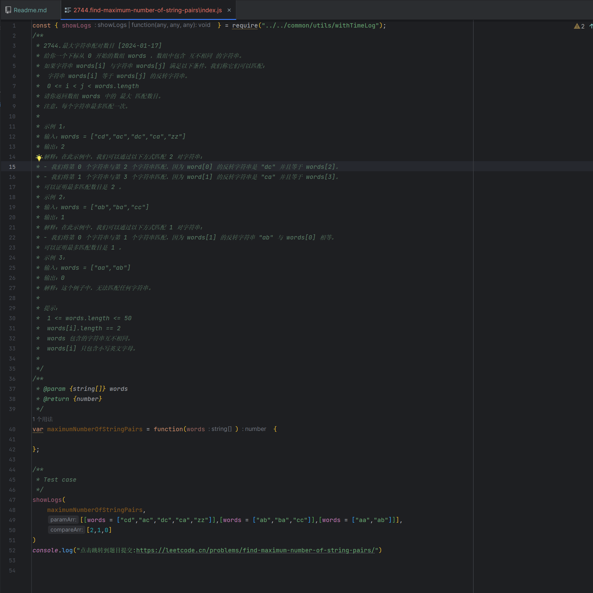
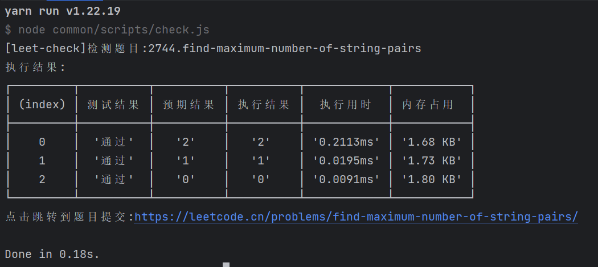

# Leetcode practice

力扣练习库!开始你的每日一题!
在编辑器中编写你的代码,简单有效的执行和计时!

## TO-DO List

- [x] 1.模板:获取js的函数体并替换生成文件中的@function
- [x] 2.模板:从detail中获取输入用例的数据填充@Testcase
- [x] 3.模板:获取跳转每日一题的链接替换@url
- [x] 4.函数:优化时间和资源统计函数
- [x] 5.优化创建时的体验，添加重复时候的确认覆盖或者添加额外符号
- [ ] 6.特殊数据结构的处理(ListNode,Stack等)的处理
- [x] 7.创建某一特定编号的题目脚本,以及实现随机题目【随机题目汇集本地题目，然后排除自己本地存在的题目进行随机】
- [ ] 8.实现在编辑器中预览图片(感觉可以不做)

## How to use for yourself ?

fork分支`template`的内容,其非内容部分会与主分支保持同步,意思是去除部分我的题目代码,然后使用指令创建你自己的题解即可!

## Preparation

只需要一个node环境即可.([如何安装node?点我了解](https://nodejs.org/en/learn/getting-started/how-to-install-nodejs))

|依赖包 |版本  |
|------|-----|
|nodejs|`lts`|

## Usage

### 0. 安装依赖

```shell
yarn install # 或者任意你喜欢的包管理工具，如
pnpm install
```

### 1. 获取今天的题目

```shell
yarn leet-create
```
会通过接口获取今日题目，并会在`src`目录下根据`你提供的指定名称(默认不填值为题目的id)`创建一个目录，并将今日题目和基础示例代码填充到`index.js`中。




### 2. 检验今天的题目

```shell
yarn leet-check
```

此指令会根据今天你的题目创建时填写的名称去执行对应的题目文件，输出结果。
> NOTE:缓存的实现是在`commom/resouces/store.json`,如果只想让内容在本地存在,不上传到个人项目中的话,执行`git update-index --aussume-unchanged common/resources/store.json`来忽略本地的文件变更即可。
> 

```shell
yarn leet-check 

[leet-check]检测题目:2744.find-maximum-number-of-string-pairs
执行结果:
┌─────────┬──────────┬──────────┬──────────┬────────────┬───────────┐
│ (index) │ 测试结果 │ 预期结果 │ 执行结果 │  执行用时  │ 内存占用  │
├─────────┼──────────┼──────────┼──────────┼────────────┼───────────┤
│    0    │  '通过'  │   '2'    │   '2'    │ '0.2113ms' │ '1.68 KB' │
│    1    │  '通过'  │   '1'    │   '1'    │ '0.0195ms' │ '1.73 KB' │
│    2    │  '通过'  │   '0'    │   '0'    │ '0.0091ms' │ '1.80 KB' │
└─────────┴──────────┴──────────┴──────────┴────────────┴───────────┘
点击跳转到题目提交:https://leetcode.cn/problems/find-maximum-number-of-string-pairs/

Done in 0.18s.

```

### 3. 创建自己想要练习的题目

```shell
# 可以使用你喜欢的任意包管理工具,例如 `pnpm`/`npm`
yarn leet-create -i [题目编号或者名称]

e.g.
yarn leet-create 1314
```

然后会在目录中创建一个模板js文件,目录结构为:

```shell
-src
└── 1314
  └── index.js # 模板js文件 可以替换题目
```

//todo 待填充

### 4. 检验自己想要练习的结果

```shell
# 可以使用你喜欢的任意包管理工具,例如 `pnpm`/`npm`
yarn leet-check -i [题目编号或者名称]

e.g.
yarn leet-check 1314
```

会出现其用时以及内存占用:

```shell
//todo 待填充
```
### 5. 获取随机题目

```shell
yarn leet-create -r
```
会获取一个当前src目录中未出现过的题目
//todo 待填充

### 6. 检验随机题目

```shell
# 可以使用你喜欢的任意包管理工具,例如 `pnpm`/`npm`
yarn leet-check -r
```
会检验上次随机出的题目编号:

```shell
//todo 待填充
```

## Scripts API Document

| script      | 参数               | 说明                                                  |
|-------------|------------------|-----------------------------------------------------|
| leet-create | [-i [题目编号]][-r]  | 创建一个题目,不带参数获取今日题目,`-i` 参数指定题号去获取，`-r` 随机题目          |
| leet-check  | [-i [题目编号]][-r]       | 执行检测一个题目,不带参数检测今日题目,`-i` 参数指定题号去检测，`-r` 检测上一个随机出的题目 |

> note:
> 名词解释: 题目编号是leet-code为其分配的唯一id,如`1314`对应题目`矩阵区域和`

## Contributor

[EternalHeart](https://github.com/wh131462)
[SmallTeddy](https://github.com/SmallTeddy)
